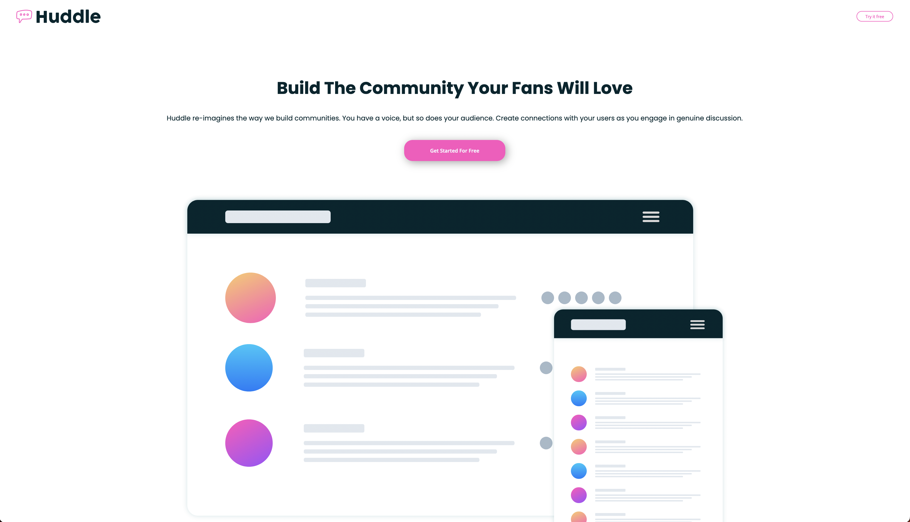

# Frontend Mentor - Huddle landing page with curved sections solution

This is a solution to the [Huddle landing page with curved sections challenge on Frontend Mentor](https://www.frontendmentor.io/challenges/huddle-landing-page-with-curved-sections-5ca5ecd01e82137ec91a50f2). Frontend Mentor challenges help you improve your coding skills by building realistic projects.

## Table of contents

- [Overview](#overview)
  - [The challenge](#the-challenge)
  - [Screenshot](#screenshot)
  - [Links](#links)
  - [Built with](#built-with)
  - [Useful resources](#useful-resources)
- [Author](#author)

## Overview

### The challenge

Users should be able to:

- View the optimal layout for the site depending on their device's screen size
- See hover states for all interactive elements on the page

### Screenshot



### Links

- Solution URL: [Add solution URL here](https://your-solution-url.com)
- Live Site URL: [Add live site URL here](https://your-live-site-url.com)

## My process

### Built with

- Semantic HTML5 markup
- CSS custom properties
- Flexbox
- CSS Grid
- Mobile-first workflow
- [React](https://reactjs.org/) - JS library
- [Next.js](https://nextjs.org/) - React framework
- [Styled Components](https://styled-components.com/) - For styles

**Note: These are just examples. Delete this note and replace the list above with your own choices**

### What I learned

Using the background image property to position certain background elements

```css
.first-section-bg {
  background-image: url(images/bg-section-top-desktop-1.svg),
    url(images/bg-section-bottom-desktop-1.svg);
  background-repeat: no-repeat, no-repeat;
  background-size: contain, contain;
  background-position: center top, center bottom;
}
```

## Author

- Website - [Apah Benson](https://apah-dev.github.io/huddle-landing-page-curved-sections/)
- Frontend Mentor - [@apah-dev](https://www.frontendmentor.io/profile/apah-dev)
- Twitter - [@benson_apah](https://www.twitter.com/benson_apah)
